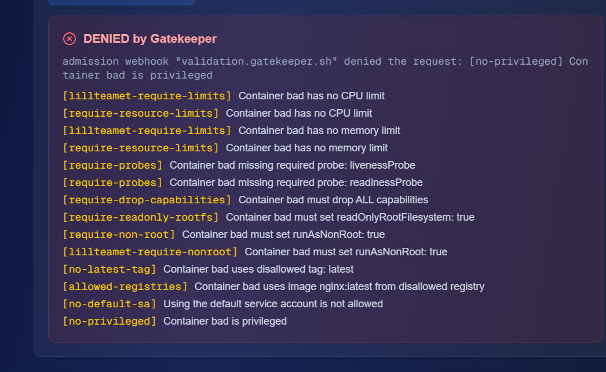
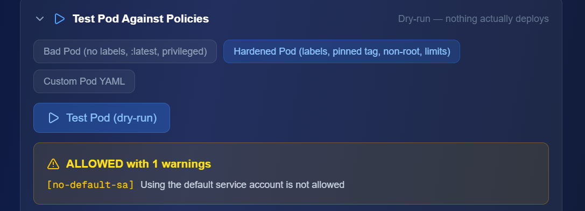

# Lab 2 - Container Security

## Vad projektet gör
Det här projektet visar skillnaden mellan en sårbar container och en härdad container. Projektet innehåller Trivy-scanning före och efter hardening, en SBOM i CycloneDX-format samt exempel på Gatekeeper-policies.

## Sårbar container
Den första imagen byggdes med en äldre Python-version och en äldre Flask-version för att visa hur en osäker container kan se ut. Resultatet sparades i `scan-before.txt`.

## Härdad container
Den härdade imagen använder en modern slim-baserad image, kör som non-root user, använder `requirements.txt` och har en `HEALTHCHECK`. Resultatet sparades i `scan-after.txt`.

## SBOM
En SBOM skapades för den härdade imagen med Trivy och sparades som `sbom.json`.

## Gatekeeper
Gatekeeper testades i Mission Control.

### Bad Pod
Bad Pod blev **DENIED by Gatekeeper**. Den stoppades bland annat för att containern var privileged, saknade CPU- och memory-limits, saknade livenessProbe och readinessProbe, använde latest-tag, otillåtet registry, default service account och flera viktiga säkerhetsinställningar.

### Hardened Pod
Hardened Pod blev **ALLOWED with 1 warnings**. Varningen gällde att default service account användes:
`[no-default-sa] Using the default service account is not allowed`

## Viktiga filer
- Dockerfile.vulnerable
- Dockerfile.hardened
- app.py
- requirements.txt
- scan-before.txt
- scan-after.txt
- sbom.json
- policies/require-labels-template.yaml
- policies/require-team-label.yaml

## Screenshots

### Gatekeeper Bad Pod

### Gatekeeper Hardened Pod

## Reflektion
Jag lärde mig att container-säkerhet börjar redan i Dockerfile. En äldre basimage och gamla paket kan ge många sårbarheter direkt. Det gjorde stor skillnad att använda en mindre och modernare image. Att köra containern som non-root minskar risken om den skulle bli komprometterad. SBOM är viktigt eftersom det visar vilka komponenter som finns i imagen och gör det lättare att förstå vad som behöver uppdateras. Gatekeeper är användbart eftersom policies kan upptäcka och stoppa osäkra konfigurationer innan resurser används i Kubernetes.